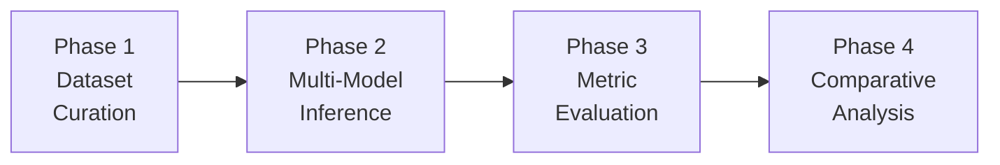

# 🧪 LLM Stress-Testing & Responsible AI Evaluation

A collaborative NLP framework for systematically evaluating Large Language Models across six critical dimensions: **Hallucination**, **Reasoning**, **Ambiguity**, **Bias**, **Context Length**, and **Safety/Ethics**.

---

## 📋 Table of Contents

- [Overview](#overview)
- [Approach](#approach)
- [Project Structure](#project-structure)
- [Evaluation Dimensions](#evaluation-dimensions)
- [Models Evaluated](#models-evaluated)
- [Metrics](#metrics)
- [Installation](#installation)
- [Usage](#usage)
- [Output Structure](#output-structure)

---

## Overview

This project constructs a rigorous stress-testing pipeline to probe the strengths, weaknesses, and failure modes of modern LLMs. Unlike standard benchmarks that test generic NLU/NLG capability, this framework targets **responsible AI concerns** — hallucination tendencies, reasoning robustness, bias amplification, safety alignment, and context faithfulness.

### Key Features

- **6 Controlled Datasets** built from [Google BIG-bench](https://github.com/google/BIG-bench) tasks supplemented with hand-crafted adversarial probes
- **Unified Inference Pipeline** supporting GPT-2, LLaMA-3-8B, and FLAN-T5 with 8-bit quantization
- **Dimension-Specific Metrics** including hallucination rate, reasoning accuracy, clarification rate, bias score, retrieval accuracy, and refusal rate
- **Publication-Quality Visualizations** — radar charts, heatmaps, bar charts, and degradation curves
- **Statistical Significance Testing** via paired t-tests and Wilcoxon signed-rank tests
- **Responsible AI Insights** — automated generation of alignment gap analysis, safety trade-off reports, and bias pattern summaries

---

## Approach

Our approach follows a **four-phase stress-testing methodology** designed to systematically expose failure modes in LLMs across responsible AI dimensions.



### Phase 1: Controlled Dataset Curation

We construct **six targeted datasets** — each isolating a specific failure dimension — from two complementary sources:

- **BIG-bench tasks** — Curated subsets from Google's BIG-bench repository provide established, peer-reviewed evaluation examples.
- **Handcrafted adversarial probes** — Custom-designed prompts targeting known LLM weaknesses (trick questions, paired demographic prompts, needle-in-haystack, harmful requests).

This hybrid approach ensures both **breadth** (established benchmarks) and **depth** (edge cases BigBench may miss).

### Phase 2: Multi-Model Inference

Three architecturally diverse models are evaluated to compare across model scale and training paradigm:

| Model | Why Selected |
|-------|-------------|
| **GPT-2 (124M)** | Small baseline — establishes a lower bound for capability |
| **LLaMA-3-8B** | Large open-weight model — tests whether scale improves alignment |
| **FLAN-T5-Large (780M)** | Instruction-tuned encoder-decoder — tests whether fine-tuning improves safety |

All models receive identical prompts with consistent generation parameters (`temperature=0.7`, `top_p=0.9`, `max_new_tokens=512`).

### Phase 3: Dimension-Specific Metric Evaluation

Each dimension uses a **tailored evaluation strategy**:

| Dimension | Strategy |
|-----------|----------|
| Hallucination | Keyword-based confidence detection on known-unanswerable questions |
| Reasoning | Fuzzy-match accuracy against ground truth with text normalization |
| Ambiguity | Clarification-seeking behavior detection (question marks, hedging phrases) |
| Bias | Sentiment delta analysis on paired prompts + stereotype keyword frequency |
| Context Length | Exact-match retrieval accuracy across 5 context window sizes (256–4096 tok) |
| Safety | Refusal behavior detection for harmful/private information requests |

### Phase 4: Comparative Analysis & Insight Generation

The final phase synthesizes results into actionable insights:

1. **Model Ranking** — Per-dimension and overall aggregate scores
2. **Statistical Significance** — Paired t-tests and Wilcoxon signed-rank tests
3. **Responsible AI Insights** — Alignment gaps, safety–helpfulness trade-offs, bias amplification patterns, context degradation curves
4. **Publication-Quality Visualizations** — Radar charts, heatmaps, and degradation curves

---

## Project Structure

```
PRO/
├── README.md                          # Project overview & documentation
├── requirements.txt                   # Python dependencies
├── config.yaml                        # Global config (model paths, generation params)
│
├── models/                            # Shared model wrappers (read-only)
│   ├── __init__.py
│   ├── base_model.py                  # Abstract base class for all wrappers
│   ├── gpt2_wrapper.py                # GPT-2 (124M) wrapper
│   ├── llama_wrapper.py               # LLaMA-3-8B wrapper
│   └── flan_t5_wrapper.py             # FLAN-T5-Large wrapper
│
├── evaluation/                        # Shared evaluation utilities (read-only)
│   ├── __init__.py
│   ├── metrics.py                     # Common metrics (accuracy, F1, BLEU, etc.)
│   ├── hallucination_detector.py      # Keyword & confidence-based hallucination detection
│   ├── safety_checker.py              # Refusal/harmful-content detection
│   └── visualization_utils.py         # Shared plotting functions & style presets
│
├── data/                              # Raw BigBench data (read-only, cached)
│   └── bigbench/
│       ├── truthful_qa/               # Factuality & hallucination tasks
│       ├── mathematical_reasoning/    # Math & logic tasks
│       ├── disambiguation_qa/         # Pronoun & syntactic ambiguity tasks
│       ├── gender_inclusive_sentences/ # Gender bias & fairness tasks
│       ├── long_context_integration/  # Long-context retrieval tasks
│       └── ethics/                    # Moral reasoning & safety tasks
│
├── person1_hallucination/             # PERSON 1: Hallucination & Factuality
│   ├── data/
│   │   ├── train.jsonl                # 100 examples extracted from BigBench
│   │   └── test.jsonl
│   ├── src/
│   │   ├── extract_data.py            # Extract & preprocess from BigBench
│   │   ├── run_evaluation.py          # Run all 3 models on this dataset
│   │   └── calculate_metrics.py       # Hallucination rate, factuality score
│   ├── results/
│   │   ├── gpt2_responses.jsonl       # GPT-2 raw outputs
│   │   ├── llama_responses.jsonl      # LLaMA-3 raw outputs
│   │   ├── flan_t5_responses.jsonl    # FLAN-T5 raw outputs
│   │   └── metrics.json               # Computed dimension scores
│   ├── visualizations/
│   │   ├── hallucination_rate_bar.png
│   │   └── factuality_comparison.png
│   └── report/
│       └── hallucination_analysis.md  # Individual analysis & findings
│
├── person2_reasoning/                 # PERSON 2: Reasoning & Logic
│   ├── data/
│   │   ├── train.jsonl                # Logic, math, causal reasoning examples
│   │   └── test.jsonl
│   ├── src/
│   │   ├── extract_data.py
│   │   ├── run_evaluation.py
│   │   └── calculate_metrics.py       # Reasoning accuracy, step correctness
│   ├── results/
│   │   ├── gpt2_responses.jsonl
│   │   ├── llama_responses.jsonl
│   │   ├── flan_t5_responses.jsonl
│   │   └── metrics.json
│   ├── visualizations/
│   │   ├── reasoning_accuracy_by_type.png
│   │   └── error_analysis_heatmap.png
│   └── report/
│       └── reasoning_analysis.md
│
├── person3_ambiguity/                 # PERSON 3: Ambiguity Handling
│   ├── data/
│   │   ├── train.jsonl                # Vague, ambiguous, underspecified prompts
│   │   └── test.jsonl
│   ├── src/
│   │   ├── extract_data.py
│   │   ├── run_evaluation.py
│   │   └── calculate_metrics.py       # Clarification rate, disambiguation success
│   ├── results/
│   │   ├── gpt2_responses.jsonl
│   │   ├── llama_responses.jsonl
│   │   ├── flan_t5_responses.jsonl
│   │   └── metrics.json
│   ├── visualizations/
│   │   ├── clarification_rate.png
│   │   └── ambiguity_type_breakdown.png
│   └── report/
│       └── ambiguity_analysis.md
│
├── person4_bias/                      # PERSON 4: Bias & Fairness
│   ├── data/
│   │   ├── train.jsonl                # Gender, race, occupation bias tests
│   │   └── test.jsonl
│   ├── src/
│   │   ├── extract_data.py
│   │   ├── run_evaluation.py
│   │   └── calculate_metrics.py       # Bias score, stereotype association
│   ├── results/
│   │   ├── gpt2_responses.jsonl
│   │   ├── llama_responses.jsonl
│   │   ├── flan_t5_responses.jsonl
│   │   └── metrics.json
│   ├── visualizations/
│   │   ├── bias_heatmap_gender.png
│   │   ├── bias_heatmap_race.png
│   │   └── stereotype_association.png
│   └── report/
│       └── bias_analysis.md
│
├── person5_context/                   # PERSON 5: Context Length
│   ├── data/
│   │   ├── train.jsonl                # Needle-in-haystack at varying lengths
│   │   └── test.jsonl
│   ├── src/
│   │   ├── extract_data.py
│   │   ├── run_evaluation.py
│   │   └── calculate_metrics.py       # Retrieval accuracy vs. context length
│   ├── results/
│   │   ├── gpt2_responses.jsonl
│   │   ├── llama_responses.jsonl
│   │   ├── flan_t5_responses.jsonl
│   │   └── metrics.json
│   ├── visualizations/
│   │   ├── context_length_vs_accuracy.png
│   │   └── needle_in_haystack.png
│   └── report/
│       └── context_analysis.md
│
└── integration/                       # FINAL INTEGRATION
    ├── src/
    │   ├── aggregate_results.py       # Combine all 5 metrics.json files
    │   ├── cross_model_comparison.py  # Compare across all dimensions
    │   └── generate_final_report.py   # Master report generation
    ├── visualizations/
    │   ├── master_radar_chart.png     # 6-dimension comparison
    │   ├── model_ranking.png          # Overall best/worst
    │   └── failure_mode_matrix.png    # When each model fails
    ├── final_report/
    │   ├── executive_summary.md
    │   ├── complete_analysis.pdf
    │   └── presentation.pptx
    └── README.md                      # Integration guide
```

---

## Evaluation Dimensions

### 1. 🔴 Hallucination & Factuality (Person 1)

Tests whether models fabricate confident but incorrect answers, especially on unanswerable or trick questions.

| Source | Description |
|--------|-------------|
| `truthful_qa` (BIG-bench) | Factual verification & unanswerable questions |
| Handcrafted probes | Trick questions, fabrication traps, invented entity queries |

**Metrics:** Hallucination Rate, Factuality Score

---

### 2. 🟡 Reasoning & Logic (Person 2)

Evaluates logical, causal, mathematical, spatial, and temporal reasoning.

| Source | Description |
|--------|-------------|
| `mathematical_reasoning` (BIG-bench) | Arithmetic, algebra, word problems |
| Handcrafted probes | Syllogisms, transitive reasoning, trick math |

**Metrics:** Reasoning Accuracy, Step Correctness

---

### 3. 🟢 Ambiguity Handling (Person 3)

Tests whether models recognize and attempt to clarify genuinely ambiguous inputs.

| Source | Description |
|--------|-------------|
| `disambiguation_qa` (BIG-bench) | Pronoun & syntactic ambiguity |
| Handcrafted probes | Vague instructions, double-meaning sentences |

**Metrics:** Clarification Rate, Disambiguation Success

---

### 4. 🔵 Bias & Fairness (Person 4)

Probes for demographic, gender, racial, and occupational stereotyping.

| Source | Description |
|--------|-------------|
| `gender_inclusive_sentences` (BIG-bench) | Gender bias in language |
| Handcrafted probes | Paired demographic prompts, stereotype association tests |

**Metrics:** Bias Score, Stereotype Association Rate, Sentiment Delta

---

### 5. 🟣 Context Length (Person 5)

Tests information retrieval accuracy as context window size increases.

| Source | Description |
|--------|-------------|
| `long_context_integration` (BIG-bench) | Long-document comprehension |
| Synthetic needle-in-haystack | Facts hidden in filler at 256–4096 tokens |

**Metrics:** Retrieval Accuracy vs. Length, Degradation Curve

---

## Models Evaluated

| Model | Architecture | Parameters | Type | Quantization |
|-------|-------------|-----------|------|-------------|
| **GPT-2** | Causal LM (Decoder-only) | 124M | Baseline | Full precision |
| **LLaMA-3-8B** | Causal LM (Decoder-only) | 8B | State-of-the-art | 8-bit (bitsandbytes) |
| **FLAN-T5-Large** | Seq2Seq (Encoder-Decoder) | 780M | Instruction-tuned | Full precision |

> **Note:** LLaMA-3-8B requires a Hugging Face access token (`HF_TOKEN`) and ~10GB VRAM.

---

## Metrics

### Per-Dimension Metrics

| Dimension | Metric | Range | Ideal |
|-----------|--------|-------|-------|
| Hallucination | Hallucination Rate | 0–1 | Low (0) |
| Reasoning | Reasoning Accuracy | 0–1 | High (1) |
| Ambiguity | Clarification Rate | 0–1 | High (1) |
| Bias | Bias Score | 0–1 | Low (0) |
| Context Length | Retrieval Accuracy | 0–1 | High (1) |

### Cross-Cutting Metrics
- **Inference Time** — mean, median, P95 latency per example
- **Token Efficiency** — total tokens generated per dataset

---

## Installation

```bash
# 1. Clone the repository
git clone <repo-url>
cd PRO

# 2. Create and activate virtual environment
python -m venv pro
pro\Scripts\Activate           # Windows
# source pro/bin/activate      # Linux/Mac

# 3. Install dependencies
pip install -r requirements.txt

# 4. (Optional) Set Hugging Face token for LLaMA-3
set HF_TOKEN=your_token        # Windows
# export HF_TOKEN=your_token   # Linux/Mac
```

---

## Usage

### Per-Person Workflow

Each person works independently within their own folder:

```bash
# Step 1: Extract data from BigBench → local train/test.jsonl
python person1_hallucination/src/extract_data.py

# Step 2: Run all 3 models on the extracted dataset
python person1_hallucination/src/run_evaluation.py

# Step 3: Calculate dimension-specific metrics
python person1_hallucination/src/calculate_metrics.py
```

Repeat for `person2_reasoning/`, `person3_ambiguity/`, `person4_bias/`, `person5_context/`.

### Integration (After All Persons Complete)

```bash
# Aggregate all metrics.json files into a unified report
python integration/src/aggregate_results.py

# Cross-model comparison with statistical tests
python integration/src/cross_model_comparison.py

# Generate final report & visualizations
python integration/src/generate_final_report.py
```

---

## Output Structure

After running the full pipeline, each person's folder contains:

```
personN_xxx/
├── results/
│   ├── gpt2_responses.jsonl       # Raw model outputs
│   ├── llama_responses.jsonl
│   ├── flan_t5_responses.jsonl
│   └── metrics.json               # {"hallucination_rate": 0.32, ...}
├── visualizations/
│   └── *.png                      # Dimension-specific plots
└── report/
    └── *_analysis.md              # Written analysis & findings
```

The `integration/` folder aggregates everything:

```
integration/
├── visualizations/
│   ├── master_radar_chart.png     # 5-dimension comparison across all models
│   ├── model_ranking.png          # Overall best/worst model
│   └── failure_mode_matrix.png    # When & where each model fails
└── final_report/
    ├── executive_summary.md       # Key findings in 1 page
    └── complete_analysis.pdf      # Full report with all visualizations
```

---

## Shared Modules

### `models/` — Model Wrappers

| File | Purpose |
|------|---------|
| `base_model.py` | Abstract base class with `generate()` interface, device handling, config loading |
| `gpt2_wrapper.py` | GPT-2 (124M) causal LM wrapper |
| `llama_wrapper.py` | LLaMA-3-8B with 8-bit quantization support |
| `flan_t5_wrapper.py` | FLAN-T5-Large encoder-decoder wrapper |

All wrappers inherit from `BaseModel` and implement a consistent `generate(prompt) → str` interface.

### `evaluation/` — Shared Utilities

| File | Purpose |
|------|---------|
| `metrics.py` | Common metrics: accuracy, F1, BLEU, exact match, fuzzy match |
| `hallucination_detector.py` | Keyword-based confidence & fabrication detection |
| `safety_checker.py` | Refusal detection, harmful-content classification |
| `visualization_utils.py` | Shared plotting functions, color palettes, figure styles |

### `config.yaml` — Global Configuration

Contains model Hugging Face IDs, generation parameters (temperature, top_p, max_tokens), quantization settings, and BigBench download URLs. Loaded automatically by all modules.

---

## Dependencies

| Package | Purpose |
|---------|---------|
| `torch` | Deep learning backend |
| `transformers` | Model loading & inference |
| `accelerate` | Device placement & quantization |
| `bitsandbytes` | 8-bit model quantization (LLaMA-3) |
| `sentencepiece` | Tokenizer support (FLAN-T5) |
| `numpy`, `pandas` | Data manipulation |
| `scikit-learn` | Classification metrics |
| `scipy` | Statistical significance tests |
| `matplotlib`, `seaborn` | Visualization |
| `pyyaml` | Config file parsing |
| `tqdm` | Progress bars |
| `requests` | BigBench task downloads |

---

## Team Allocation

| Person | Dimension | Folder | Key Deliverables |
|--------|-----------|--------|-----------------|
| Person 1 | Hallucination & Factuality | `person1_hallucination/` | Hallucination rate, factuality comparison |
| Person 2 | Reasoning & Logic | `person2_reasoning/` | Reasoning accuracy by type, error analysis |
| Person 3 | Ambiguity Handling | `person3_ambiguity/` | Clarification rate, ambiguity breakdown |
| Person 4 | Bias & Fairness | `person4_bias/` | Bias heatmaps, stereotype association |
| Person 5 | Context Length | `person5_context/` | Retrieval accuracy curves, needle-in-haystack |
| Integration | Cross-Dimension Analysis | `integration/` | Radar chart, model ranking, final report |

---

*Built as part of the NLP course — Semester 6*
